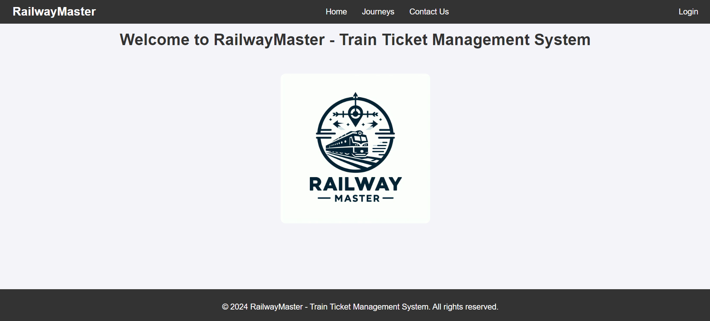

# Train Ticket Management System

### Introduction
The train ticket management system is a web application built using Django. It allows customers and train operators to manage train journey bookings and view journey details.

Here is a screenshot of the application:


### Getting started (locally)
#### Prerequisites
* Python 3 or higher
* MySQL

#### Installation
1. Clone only the specific project directory from the repository:

```
git clone --no-checkout https://github.com/isrkan/FullStackPractice.git
cd FullStackPractice
git sparse-checkout init --cone
git sparse-checkout set "Projects/Django/train-ticket-management"
git fetch
git pull
git read-tree -mu HEAD
 ```

2. Navigate to the directory:

```
cd "Projects/Django/train-ticket-management"
```

3. Create and activate a virtual environment:

```
python -m venv trainenv
.\trainenv\Scripts\Activate
```

Then, install the required Python packages using `pip`:

```
pip install -r requirements.txt
```

4. Navigate to the `train_ticket_management` project directory:

```
cd "train_ticket_management"
```

5. Configure the database: Update the `settings.py` file in the `train_ticket_management` directory with your database configuration. Create a new database named `trains`.

6. Create and apply database migrations

```
python manage.py makemigrations ticket_management
python manage.py migrate
```

Then, load the initial data into the database:

```
python manage.py loaddata data.json
```

7. Start the application:

```
python manage.py runserver
```

8. Open your web browser and go to:

```
http://localhost:8000
```