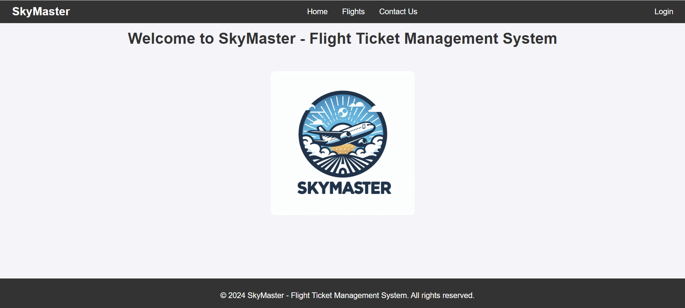

# Flight Ticket Management System

### Introduction
The flight ticket management System is a web application built using Spring Boot. It allows customers and airlines to manage flight bookings and view flight details.

Here is a screenshot of the application:


### Getting started (locally)
#### Prerequisites
* Java 17 or higher
* Maven
* PostgreSQL

#### Installation
1. Clone only the specific project directory from the repository:

```
git clone --no-checkout https://github.com/isrkan/FullStackPractice.git
cd FullStackPractice
git sparse-checkout init --cone
git sparse-checkout set "Projects/Spring Boot/flight-ticket-management"
git fetch
git pull
git read-tree -mu HEAD
 ```

2. Navigate to the project directory:

```
cd "Projects/Spring Boot/flight-ticket-management"
```

3. Configure the database: Update the `application.properties` file in the `src/main/resources` directory with your database configuration.

4. Build the project using Maven:

```
mvn clean install
```

5. Start the application:

```
mvn spring-boot:run
```

6. Open your web browser and go to:

```
http://localhost:8080
```

### Getting started with Docker
#### Prerequisites
* Docker Engine

#### Installation
1. Clone only the specific project directory from the repository if you haven't already:

```
git clone --no-checkout https://github.com/isrkan/FullStackPractice.git
cd FullStackPractice
git sparse-checkout init --cone
git sparse-checkout set "Projects/Spring Boot/flight-ticket-management"
git fetch
git pull
git read-tree -mu HEAD
```

2. Navigate to the project directory:

```
cd "Projects/Spring Boot/flight-ticket-management"
```

3. Build the project using Maven to create the JAR file:

```
mvn clean install
```

4. Start Docker Engine by opening Docker Desktop

5. Start the application using Docker Compose:

```
docker-compose up
```

6. Open your web browser and go to:

```
http://localhost:8082
```

### Getting started with Kubernetes
#### Prerequisites
* Minikube
* Docker Engine

#### Installation
1. Clone only the specific project directory from the repository if you haven't already:

```
git clone --no-checkout https://github.com/isrkan/FullStackPractice.git
cd FullStackPractice
git sparse-checkout init --cone
git sparse-checkout set "Projects/Spring Boot/flight-ticket-management"
git fetch
git pull
git read-tree -mu HEAD
```

2. Navigate to the project directory:

```
cd "Projects/Spring Boot/flight-ticket-management"
```

3. Start Docker Engine by opening Docker Desktop.

4. Start Minikube:

```
minikube start
```

5. Apply the Kubernetes configurations:

* Navigate to the Kubernetes configuration files directory:

```
cd k8s-files
```

* Apply the Persistent Volume Claim:

```
kubectl apply -f postgres-pvc.yaml
```

* Deploy PostgreSQL:

```
kubectl apply -f postgres-deployment.yaml
kubectl apply -f postgres-service.yaml
```

* Deploy the Spring Boot Application:

```
kubectl apply -f flight-ticket-management-deployment.yaml
kubectl apply -f flight-ticket-management-service.yaml
```

6. Check the status of the pods:

```
kubectl get pods
```

7. Access the application:
    
```
minikube service flight-ticket-management-service
```

This will open the web browser to the service URL provided by Minikube.
